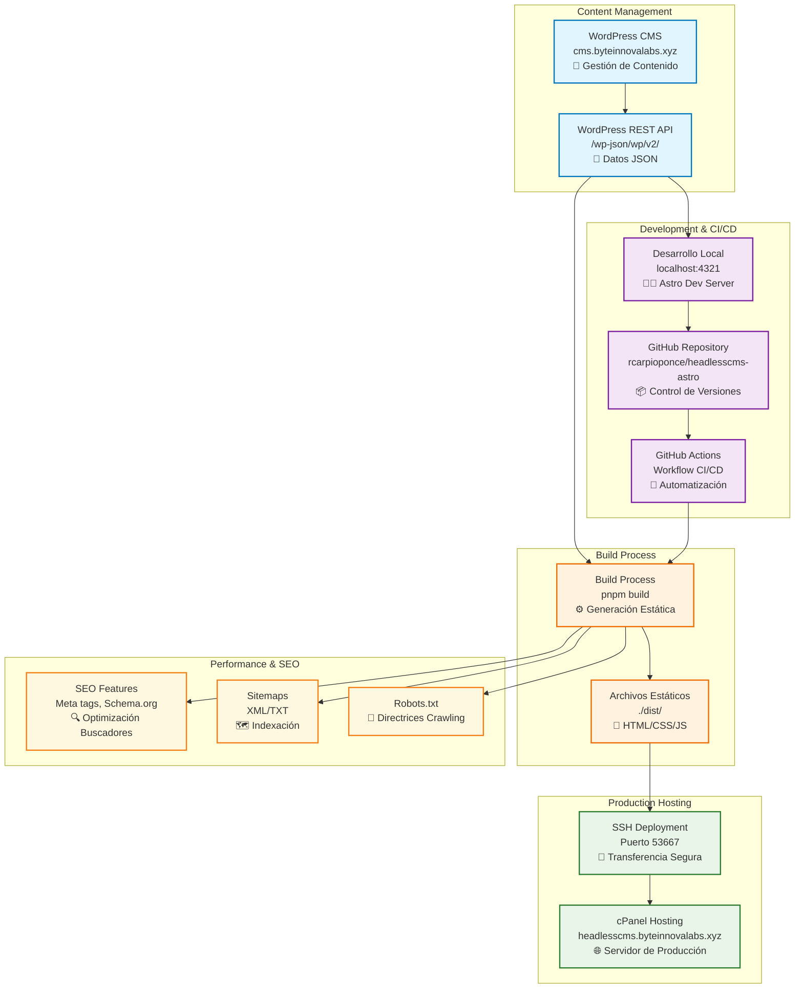

# WordPress Headless CMS con Astro

Un blog moderno y rápido que consume contenido de WordPress mediante su REST API, construido con Astro y desplegado automáticamente con GitHub Actions.

## 📋 Características

- ✅ **Headless CMS**: WordPress como backend para gestión de contenido
- ✅ **Static Site Generation**: Generación estática con Astro para máximo rendimiento
- ✅ **CI/CD Automatizado**: Despliegue automático con GitHub Actions
- ✅ **SEO Optimizado**: Meta tags, Open Graph, Schema.org y sitemaps
- ✅ **Responsive Design**: Diseño adaptativo con tema oscuro moderno
- ✅ **Paginación Inteligente**: 6 posts por página con navegación fluida
- ✅ **Tiempo de Lectura**: Cálculo automático del tiempo estimado de lectura
- ✅ **Optimización de Imágenes**: Lazy loading y responsive images

## 🏗️ Arquitectura del Sistema



## � Flujo de Trabajo

### 1. **Gestión de Contenido**
```
WordPress Admin → Crear/Editar Posts → REST API → JSON Data
```

### 2. **Desarrollo Local**
```
API Fetch → Astro Components → Static Generation → Local Preview
```

### 3. **Despliegue Automático**
```
Git Push → GitHub Actions → Build Process → SSH Deploy → Production
```

## 🌐 URLs del Sistema

| Entorno | URL | Propósito |
|---------|-----|-----------|
| **WordPress CMS** | `https://cms.byteinnovalabs.xyz` | Administración de contenido |
| **API Endpoint** | `https://cms.byteinnovalabs.xyz/wp-json/wp/v2/posts` | Datos JSON |
| **Desarrollo** | `http://localhost:4321` | Servidor local |
| **Producción** | `https://headlesscms.byteinnovalabs.xyz` | Sitio web público |

## 🚀 Estructura del Proyecto

```
/
├── 📁 public/                    # Archivos estáticos
│   ├── favicon.svg              # Icono del sitio
│   ├── robots.txt               # Directrices para crawlers
│   └── sitemap-*.xml           # Sitemaps generados
├── 📁 src/
│   ├── 📁 components/           # Componentes reutilizables
│   │   ├── Breadcrumbs.astro   # Navegación breadcrumb
│   │   ├── HeroImage.astro     # Imágenes destacadas
│   │   ├── PostCard.astro      # Tarjetas de posts
│   │   ├── ReadingTime.astro   # Tiempo de lectura
│   │   ├── SEO.astro          # Meta tags y SEO
│   │   └── Pagination.astro    # Navegación páginas
│   ├── 📁 layouts/             # Layouts base
│   │   └── Layout.astro        # Layout principal
│   ├── 📁 lib/                 # Lógica de negocio
│   │   ├── wp.ts              # API WordPress
│   │   └── schema.ts          # Schema.org data
│   ├── 📁 pages/              # Rutas del sitio
│   │   ├── index.astro        # Página principal
│   │   ├── blog/[slug].astro  # Posts individuales
│   │   ├── page/[page].astro  # Páginas paginadas
│   │   ├── sitemap-index.xml.ts # Sitemap principal
│   │   └── robots.txt.ts      # Robots dinámico
│   ├── 📁 styles/             # Hojas de estilo
│   │   ├── global.css         # Estilos globales
│   │   ├── index.css          # Página principal
│   │   └── post.css           # Posts individuales
│   └── 📁 utils/              # Utilidades
│       ├── transformHtmlImages.ts # Optimización imágenes
│       └── readingTime.ts     # Cálculo tiempo lectura
├── 📄 astro.config.mjs         # Configuración Astro
├── 📄 package.json             # Dependencias
├── 📄 tsconfig.json           # Configuración TypeScript
└── 📄 .github/workflows/      # GitHub Actions
    └── deploy.yml             # Pipeline CI/CD
```

## ⚙️ Tecnologías Utilizadas

| Categoría | Tecnología | Versión | Propósito |
|-----------|------------|---------|-----------|
| **Framework** | Astro | 5.13.5 | Static Site Generator |
| **CMS** | WordPress | Latest | Gestión de contenido |
| **Styling** | CSS3 | - | Tema oscuro responsive |
| **TypeScript** | TypeScript | Latest | Tipado estático |
| **CI/CD** | GitHub Actions | - | Automatización despliegue |
| **Hosting** | cPanel | - | Servidor de producción |

## 🚀 Comandos Disponibles

| Comando | Acción | Descripción |
|---------|--------|-------------|
| `pnpm install` | Instalación | Instala todas las dependencias del proyecto |
| `pnpm dev` | Desarrollo | Inicia servidor local en `localhost:4321` |
| `pnpm build` | Construcción | Genera sitio estático en `./dist/` |
| `pnpm preview` | Vista previa | Preview del build antes del despliegue |
| `pnpm astro add` | Integración | Añade integraciones de Astro |
| `pnpm astro check` | Verificación | Verifica errores de TypeScript |

## 🔧 Configuración del Entorno

### Variables de Entorno
```bash
# No se requieren variables de entorno
# La API de WordPress es pública
WORDPRESS_API_URL=https://cms.byteinnovalabs.xyz/wp-json/wp/v2
```

### Configuración de GitHub Actions
El archivo `.github/workflows/deploy.yml` está configurado con:
- **Trigger**: Push a rama `main`
- **Build**: `pnpm install` && `pnpm build`
- **Deploy**: SSH a cPanel (puerto 53667)
- **Secrets necesarios**:
  - `SSH_HOST`: Host del servidor
  - `SSH_USERNAME`: Usuario SSH
  - `SSH_PASSWORD`: Contraseña SSH

## 📊 Características de Rendimiento

### SEO Optimización
- ✅ Meta tags dinámicos
- ✅ Open Graph para redes sociales
- ✅ Schema.org structured data
- ✅ Sitemaps XML automáticos
- ✅ Breadcrumbs de navegación
- ✅ Tiempo de lectura calculado

### Performance Features
- ✅ Static Site Generation (SSG)
- ✅ Lazy loading de imágenes
- ✅ Responsive images automáticas
- ✅ CSS minificado en producción
- ✅ Compresión automática de assets

### UX/UI Features
- ✅ Diseño responsive mobile-first
- ✅ Tema oscuro moderno
- ✅ Navegación intuitiva
- ✅ Paginación fluida (6 posts/página)
- ✅ Breadcrumbs contextuales

## 🚀 Deployment Pipeline

### Proceso Automático
1. **Desarrollo** → Commit & Push a `main`
2. **GitHub Actions** → Detecta cambios
3. **Build Process** → Genera archivos estáticos
4. **SSH Deploy** → Transfiere a servidor cPanel
5. **Live Site** → Actualización instantánea

### Monitoreo
- Build status en GitHub Actions
- Logs de despliegue disponibles
- Verificación automática post-deploy

## 📚 Recursos Adicionales

- 📖 [Documentación de Astro](https://docs.astro.build)
- 🔌 [WordPress REST API](https://developer.wordpress.org/rest-api/)
- � [GitHub Actions](https://docs.github.com/en/actions)
- 🎨 [Guía de Schema.org](https://schema.org/)

## 🤝 Contribución

1. Fork el repositorio
2. Crear una rama feature (`git checkout -b feature/nueva-caracteristica`)
3. Commit los cambios (`git commit -am 'Añadir nueva característica'`)
4. Push a la rama (`git push origin feature/nueva-caracteristica`)
5. Crear un Pull Request

## 📝 Licencia

Este proyecto está bajo la Licencia MIT. Ver el archivo `LICENSE` para más detalles.

---

**Desarrollado con ❤️ usando Astro y WordPress Headless CMS**
